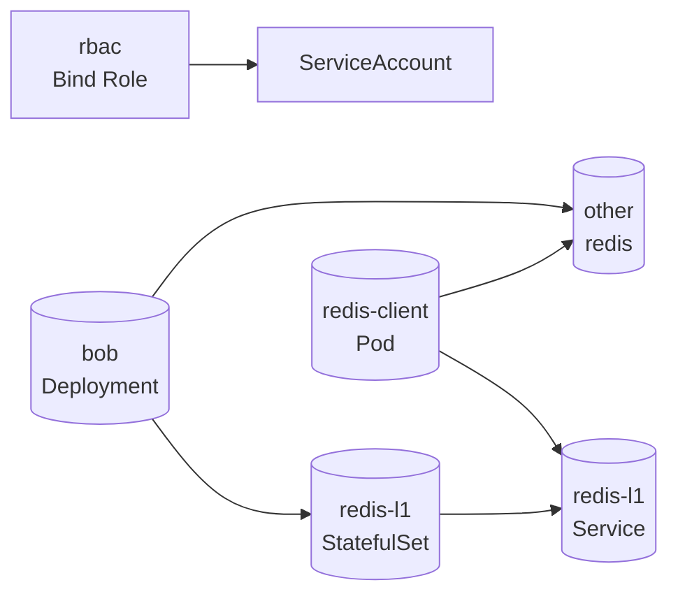

# Biomes Game Analysis

- [Biomes Analysis](#biomes-game-analysis)
  - [概述](#启动脚本概述)

## 启动脚本概述
python文件主要实现了一个本地开发环境的搭建和管理功能,可以用来在本地运行和调试Biomes服务器。
根目录下的部署脚本文件实际的功能都有 scripts/b 目录下python文件调度执行的。

## b.py:

这个文件实现了本地启动和管理Biomes服务器的主要逻辑。
主要包含:

1. GameConfig: 开发环境配置参数。
2. ServerSpec: 定义服务器规范。
3. LogSink: 日志输出功能。
4. run: 启动一组指定的服务器。
5. kill:结束运行的服务器进程。
6. run_thread: 启动线程。
7. print_banner: 打印banner。
8. place_in_startup_order:计算服务器启动顺序。
9. wait_or_die: 等待服务器进程结束,如果异常则退出。
10. run_node:启动node.js服务器进程。
11. Server: 封装对单个服务器的管理。
12. determine_servers: 根据目标计算需要启动的服务器列表。
13. check_ports_available: 检查端口是否可用。
14. print_startup_banner: 打印启动完成提示。
15. 其他辅助方法。

## data_snapshot.py:
这个文件实现了与Biomes生产环境数据快照(snapshot)相关的功能。
主要包含:

1. create_to_file: 从生产环境拉取最新的快照数据,并打包成tar文件。
2. upload_from_file: 将本地的tar文件上传到云端作为最新的快照数据。
3. install_from_file: 从本地tar文件中安装快照数据到本地开发环境。
4. uninstall: 删除本地开发环境中的快照数据。
5. pull: 如果本地快照数据过期,则从生产环境拉取最新快照数据并安装。
6. populate_redis: 将安装的快照数据加载到本地的Redis数据库中。
7. ensure_redis_populated: 检查本地Redis是否已使用最新快照数据进行了初始化,如果没有则进行初始化。
8. download_to_file: 从生产环境下载最新快照到本地文件。
9. run: 进行一系列操作以基于快照数据运行本地开发环境,包括拉取最新快照、初始化Redis等。

## pip_install_voxeloo.py:

这个文件包含一些工具函数,用于通过pip安装和更新本地的voxeloo模块。
主要包含:

1. ensure_pip_install_voxeloo: 一个decorator,在调用需要voxeloo模块的函数前,先确保voxeloo是已经通过pip安装和更新过的。
2. run_pip_install_voxeloo: 通过pip实际进行voxeloo模块的安装。
3. run_pip_install_requirements: 通过pip安装requirements.txt中的依赖包。
## bootstrap.py:

这个脚本用于进行一些基础环境检查,以确保本地机器环境满足运行Biomes服务器的基本要求。
主要包含:

1. check_version: 检查Python版本。
2. ensure_deps_are_available: 检查并安装一些必要的Python依赖库。
3. check_git_lfs_is_installed: 检查git-lfs是否安装。
4. check_bazel_installed: 检查Bazel是否安装。
5. check_rsync_installed: 检查rsync是否安装。
6. main: 启动依次进行一系列环境检查。

## galois.py:

这个文件实现了与Galois前端资产相关的管理和构建功能。
主要包含:

1. build: 构建Galois组件。
2. lint: 对源代码进行lint。
3. test: 运行测试。
4. assets: 资产相关子命令。
5. dump: 导出资产数据。
6. export: 构建资产。
7. publish: 发布资产。
8. check_assets_published: 检查资产是否已发布。
9. viewer: 查看器App相关子命令。
10. editor: 编辑器App相关子命令。
其他辅助方法。

## K8S 学习研究学习分析启动关系
* bob.yaml: 定义了一个名为bob的Deployment,它运行一个Docker容器,提供bob服务。
* kustomization.yaml: 使用kustomize来自定义kubernetes资源。它引用了rbac.yaml和redis-l1.yaml。
* rbac.yaml: 定义了一个ClusterRole和ClusterRoleBinding,授予ServiceAccount访问kubernetes API的权限。
* redis-l1.yaml: 定义了一个名为redis-l1的StatefulSet,运行redis容器提供redis服务。
* redis-client.yaml: 一个调试pod,提供访问redis的客户端。

